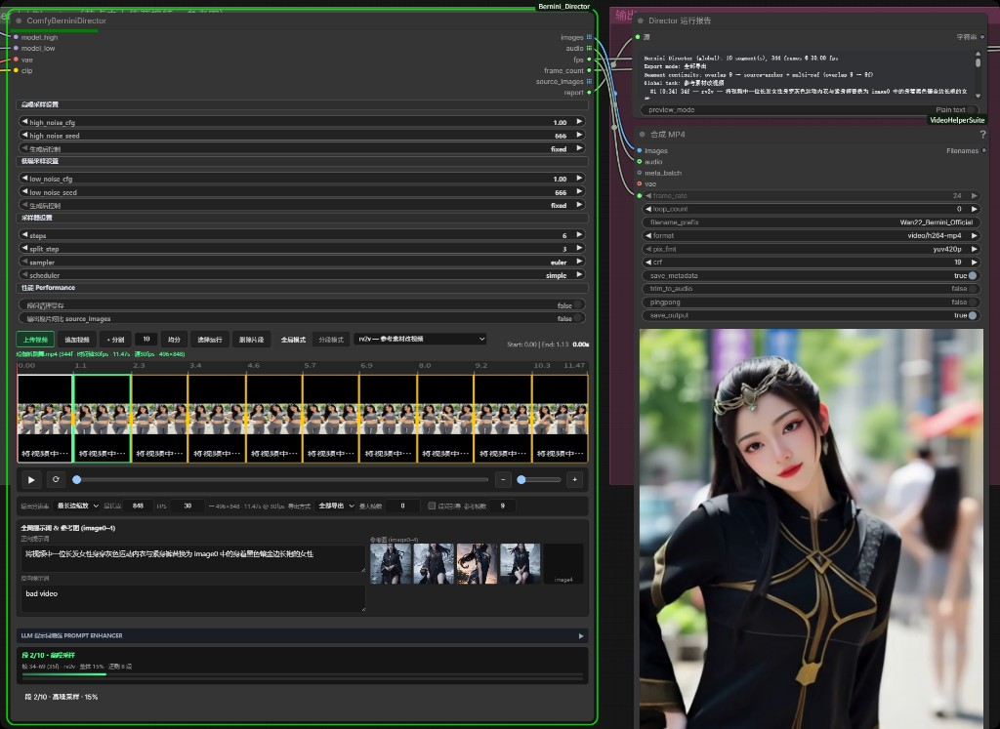

# ComfyUI Bernini Director

Multi-segment Bernini timeline director for **official ComfyUI Bernini-R**.  
Repository: [AIMixer/ComfyUI_Bernini_Director](https://github.com/AIMixer/ComfyUI_Bernini_Director)

**中文文档** → [README_ZH.md](README_ZH.md)



## Features

**ComfyBerniniDirector** is a single-node director for long-form, multi-segment Bernini video generation — timeline planning, conditioning, dual-stage sampling, and export in one place.

### Core capabilities

| Feature | Description |
|---------|-------------|
| **Multi-segment timeline** | Upload video in-node; split, equal-split, append; visual timeline with per-segment preview |
| **Task modes** | v2v, rv2v, r2v, t2v, etc. (inferred from inputs per official Bernini) |
| **Reference images** | Up to 5 refs (image0–image4); `@imageN` mentions in prompts |
| **Dual-stage sampling** | Separate HIGH / LOW UNET with independent CFG, seed, steps, split |
| **Segment continuity** | Off by default (= official Studio per-segment path); when checked, runs a separate cross-segment injection branch |
| **LLM prompt enhance** | Built-in Ollama / Zhipu APIs with Bernini official templates |
| **Audio export** | `audio` output when source video has a track (connect to VHS) |
| **Run report** | `report` output with segment plan, continuity settings, per-segment summary |

### Inputs / outputs

**Inputs:** `model_high` → `model_low` → `vae` → `clip`

**Outputs:** `images` → `audio` → `fps` → `frame_count` → `source_images` → `report`

> Apply **ModelSamplingSD3** externally on `model_high` / `model_low` for shift — do not duplicate inside the director node.

## Requirements

Upgrade **ComfyUI** to a build that includes official Bernini support or newer ([PR #14216](https://github.com/Comfy-Org/ComfyUI/pull/14216)).

## Installation

### Method 1: Manual (standard)

```bash
cd ComfyUI/custom_nodes
git clone https://github.com/AIMixer/ComfyUI_Bernini_Director.git
```

Optional:

```bash
pip install -r ComfyUI_Bernini_Director/requirements.txt
```

Restart ComfyUI.

### Method 2: ComfyUI Manager

1. Open **ComfyUI Manager**
2. Choose **Install via Git URL**
3. Enter `https://github.com/AIMixer/ComfyUI_Bernini_Director.git` and install
4. Restart ComfyUI

## Models & workflow downloads

Full pack (**Bernini weights** + **example JSON workflows**):

**[Comfyit · article 489 — Bernini models & workflows](https://comfyit.cn/article/489)**

Merge `models/` into `ComfyUI/models/`, then drag a JSON workflow into ComfyUI.

This repo also ships examples under `example_workflows/`:

| Workflow | task_type | Notes |
|----------|-----------|--------|
| `bernini_director_core_rv2v.json` | rv2v | Source video + reference image |

### Quantized models (GGUF / FP8)

**Download:** [comfyit.cn/article/489](https://comfyit.cn/article/489) (GGUF, scaled FP8, VAE, T5, and example workflows).

This plugin uses the **official ComfyUI path**. Prefer **UNETLoader** with **FP8 safetensors**:

- `Wan22_Bernini_HIGH_fp8_e4m3fn_scaled.safetensors` → `models/diffusion_models/`
- `Wan22_Bernini_LOW_fp8_e4m3fn_scaled.safetensors` → `models/diffusion_models/`
- `wan_2.1_vae.safetensors` → `models/vae/`
- `umt5_xxl_fp8_e4m3fn_scaled.safetensors` → `models/text_encoders/`

## Quick start

1. Ensure ComfyUI includes official Bernini support ([PR #14216](https://github.com/Comfy-Org/ComfyUI/pull/14216))
2. Load an example from [article 489](https://comfyit.cn/article/489) or `example_workflows/`
3. Connect VAE / UNET×2 / CLIP, upload source video / refs in the director UI, edit prompts, Queue

## Ecosystem · [Comfyit](https://comfyit.cn/)

| Resource | Link |
|----------|------|
| Models & workflows pack | [comfyit.cn/article/489](https://comfyit.cn/article/489) |
| Product center | [comfyit.cn/products](https://comfyit.cn/products) |
| Plugins | [comfyit.cn/plugins](https://comfyit.cn/plugins) |
| Models | [comfyit.cn/resources/models](https://comfyit.cn/resources/models) |
| Workflows | [comfyit.cn/workflows](https://comfyit.cn/workflows) |

## Contact

| | |
|---|---|
| **Maintainer** | [AIMixer](https://github.com/AIMixer) |
| **Repository** | [github.com/AIMixer/ComfyUI_Bernini_Director](https://github.com/AIMixer/ComfyUI_Bernini_Director) |
| **Author QQ** | **3697688140** |
| **Bilibili** | [space.bilibili.com/1997403556](https://space.bilibili.com/1997403556) |
| **QQ groups** | **551482703** · **425064221** · **559826331** |
| **Comfyit** | [comfyit.cn](https://comfyit.cn/) |

## Credits

- [Comfy-Org / ComfyUI](https://github.com/Comfy-Org/ComfyUI) — official Bernini support
- [bytedance/Bernini](https://github.com/bytedance/Bernini) — Bernini-R model & docs

## License

Apache-2.0
